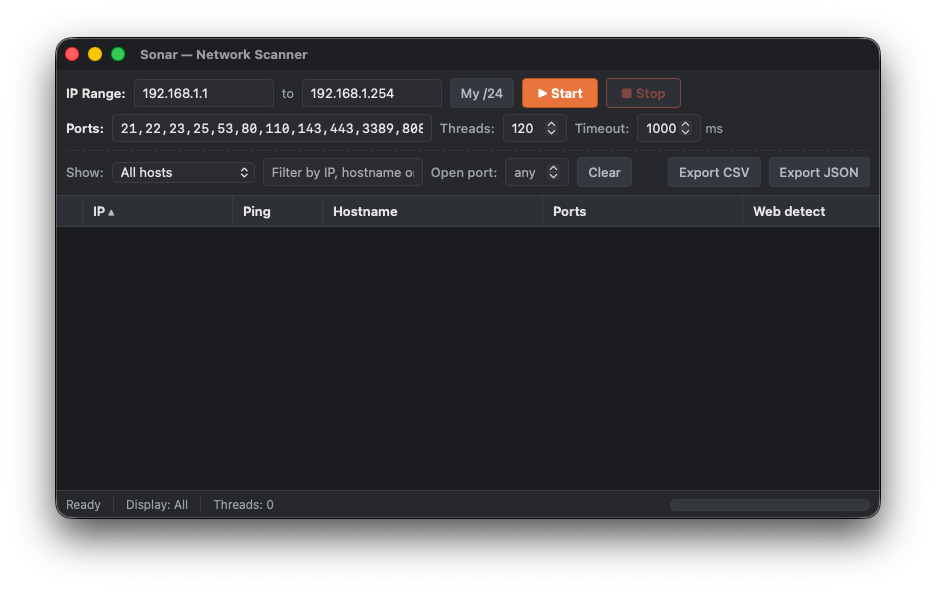

# Sonar

A cross-platform desktop **network / IP range scanner**.
A network sweep is basically sonar — send a ping, listen for the echo.
Built with [Tauri 2](https://tauri.app/) — a Rust backend does the scanning, a lightweight
HTML/CSS/JS frontend renders the results table.

Columns: **status · IP · Ping · Hostname · Ports · Web detect**



## Features

- **IP range scan** — give a start and end IPv4 address, **or a CIDR** like `192.168.1.0/24`
  in the start field; hosts are probed concurrently.
- **Local subnet auto-detect** — the **My /24** button detects this machine's IP and fills in its
  `/24` range.
- **Liveness + ping time** — uses the system `ping` (no root required) and shows round-trip ms.
- **TCP port scan** — configurable port list, supports ranges (e.g. `22,80,443,8000-8100`).
  Open ports are labelled with their service (`22 (SSH)`, `443 (HTTPS)`, …).
- **Reverse DNS** — resolves PTR records into the Hostname column.
- **Web server detection** — grabs the HTTP `Server:` banner from open web ports (80/8080/…).
- **Sortable columns** — click any header to sort by status, IP, ping, hostname, open-port count,
  or web server (click again to reverse).
- **Export** — save the currently visible (filtered) rows to **CSV** or **JSON** via a native
  Save dialog.
- **Live results** — rows stream in as they finish and stay sorted by IP; a progress bar and
  cancellable **Stop** button track the run.
- **Adjustable concurrency & timeout** — tune threads and per-probe timeout for speed vs. accuracy.
- **Result filters** (see below).
- **Automatic light/dark theme** — follows your OS appearance setting via
  `prefers-color-scheme` (no toggle needed); native inputs and scrollbars adapt too.
- **Status dots** — 🟢 green = open ports found, 🔵 blue = responding but no open ports,
  🔴 red = no response.

### Result filters

The filter row above the table narrows what's displayed without re-scanning:

| Filter | What it does |
| --- | --- |
| **Show** | Status dropdown: _All hosts_, _Alive (responding)_, _With open ports_, or _Dead_. |
| **Search** | Free-text match across IP, hostname, detected web server, and open ports. |
| **Open port** | Show only hosts with a specific port open (e.g. `443`). |
| **Clear** | Reset all filters back to showing everything. |

Filters apply live — both to rows already in the table and to new results as they arrive — and the
status bar shows `Showing X/Y` while any filter is active.

## Project layout

```
sonar/
├── src/                       # Frontend (no bundler — plain HTML/CSS/JS)
│   ├── index.html
│   ├── styles.css
│   └── main.js                # UI, events, filtering
├── src-tauri/                 # Rust backend
│   ├── src/lib.rs             # scan engine: ping, port scan, DNS, web detect
│   ├── src/main.rs
│   ├── tauri.conf.json
│   ├── capabilities/          # Tauri permissions
│   └── Cargo.toml
├── linux-build/               # Containerized Linux build
│   ├── Dockerfile
│   └── build.sh
├── windows-build/             # Containerized Windows cross-compilation
│   ├── Dockerfile
│   └── build.sh
├── build.sh                   # Cross-platform build script (macOS/Linux/Windows)
├── dist/                      # Build artifacts output directory
├── .github/workflows/         # CI that builds native Linux bundles
└── package.json
```

## Prerequisites

- [Rust](https://rustup.rs/) (stable)
- [Node.js](https://nodejs.org/) 18+ (provides the Tauri CLI)
- Platform WebView deps:
  - **macOS** — none (uses system WebKit)
  - **Linux** — `libwebkit2gtk-4.1-dev libgtk-3-dev librsvg2-dev libayatana-appindicator3-dev`
  - **Windows** — WebView2 (preinstalled on Windows 11)

```bash
npm install        # installs @tauri-apps/cli
```

## Run (development)

```bash
npm run dev        # == npx tauri dev
```

The default range is `192.168.1.1 → 192.168.1.254`. Press **▶ Start** to scan your LAN.

## Build (production)

A unified build script handles cross-platform builds. All artifacts are collected in the `dist/` folder.

### Quick start

```bash
./build.sh macos           # Build for macOS only
./build.sh linux           # Build for Linux via Docker
./build.sh windows         # Build for Windows via cross-compilation
./build.sh all             # Build for all platforms
./build.sh -c all          # Clean and rebuild all
```

Or via npm:

```bash
npm run build:macos
npm run build:linux
npm run build:windows
npm run build:all
```

### Platform requirements

| Platform | Method | Requirements |
|----------|--------|--------------|
| **macOS** | Native | None (uses system WebKit) |
| **Linux** | Docker | Docker installed and running |
| **Windows** | Docker | Docker installed and running |

### Output artifacts

| Platform | Formats | Location |
|----------|---------|----------|
| macOS | `.dmg`, `.app` | `dist/` |
| Linux | `.deb`, `.AppImage` | `dist/` |
| Windows | `.exe` (NSIS installer) | `dist/` |

### Manual builds

For direct Tauri builds without the wrapper script:

```bash
npm run build      # == npx tauri build (current platform)
```

Bundles are written to `src-tauri/target/release/bundle/`.

### Building Linux bundles from macOS (Docker)

The `linux-build/` folder contains a reproducible amd64 builder image. The `./build.sh linux`
command handles this automatically, but you can also run it manually:

```bash
# 1. Build the image once
docker build --platform=linux/amd64 -t sonar-linux-builder -f linux-build/Dockerfile linux-build

# 2. Produce the bundles
docker run --rm --platform=linux/amd64 \
  -v "$PWD":/app -e HOST_UID=$(id -u) -e HOST_GID=$(id -g) \
  sonar-linux-builder bash /app/linux-build/build.sh
```

Install the resulting package on Debian/Ubuntu:

```bash
sudo apt install ./dist/Sonar_1.0.0_amd64.deb
```

> **Note:** On Apple Silicon, the `.deb` builds fine but the **AppImage** step may fail — its
> packaging tools (`linuxdeploy`) can crash under x86_64 QEMU emulation. For native x86_64
> AppImage builds, use real x86_64 hardware or the GitHub Actions workflow.

## How it works

The frontend calls two Tauri commands in [`src-tauri/src/lib.rs`](src-tauri/src/lib.rs):

- `scan(options)` — walks the range, bounded by a `tokio` semaphore (`threads`). For each host it
  pings, probes every requested port concurrently, and — if alive — does a reverse-DNS lookup and an
  HTTP banner grab. Each host is emitted as a `scan-result` event, with `scan-progress` and
  `scan-finished` for UI state.
- `cancel_scan()` — sets a shared atomic flag so an in-flight scan stops early.
- `local_ipv4()` — returns this host's primary IPv4 for the subnet auto-detect button.
- `export_results(default_name, content)` — opens a native Save dialog and writes the export file.

Scanning uses only unprivileged techniques (system `ping` + TCP connect), so **no `sudo` is
required**. Sorting, filtering, service-name labels, and CIDR expansion all happen in the frontend.

## Responsible use

This is a standard network-administration tool. Only scan networks you own or are explicitly
authorized to test. Port scanning unfamiliar networks may violate acceptable-use policies or law.
